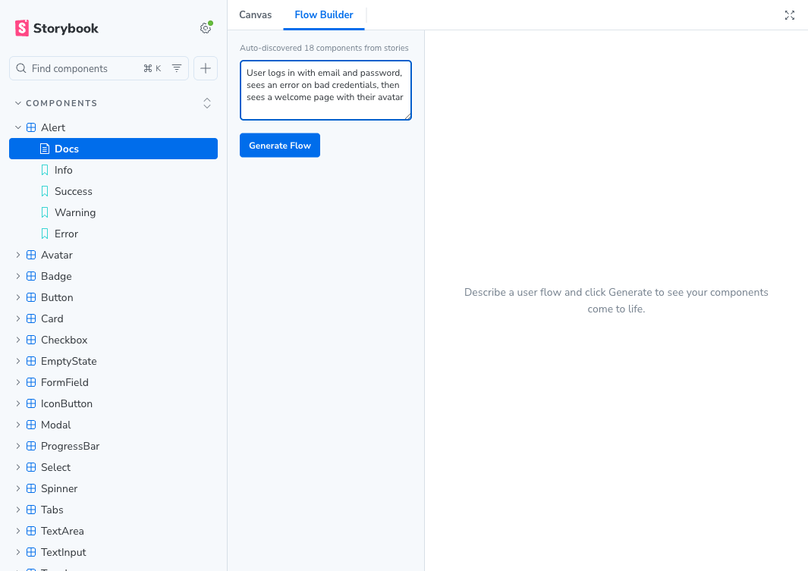
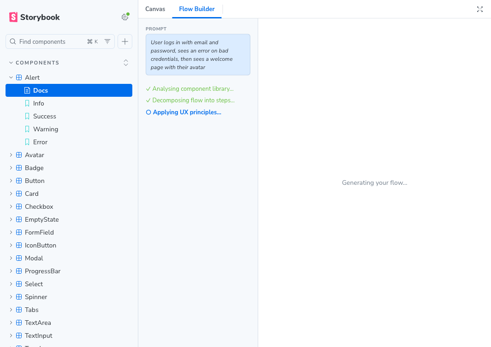
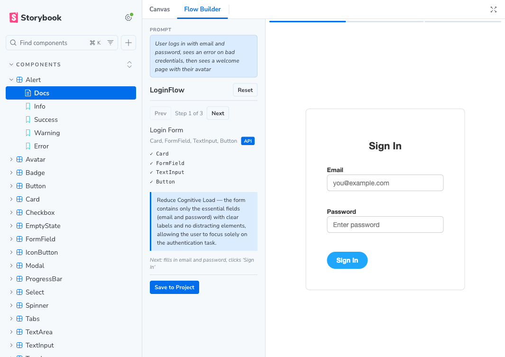
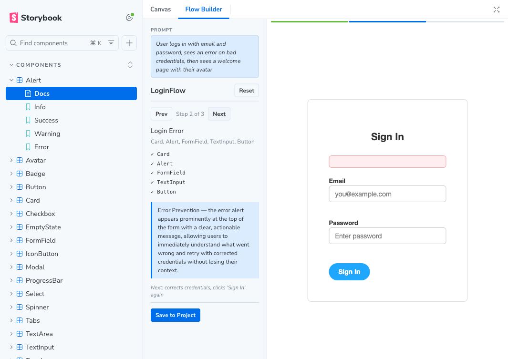
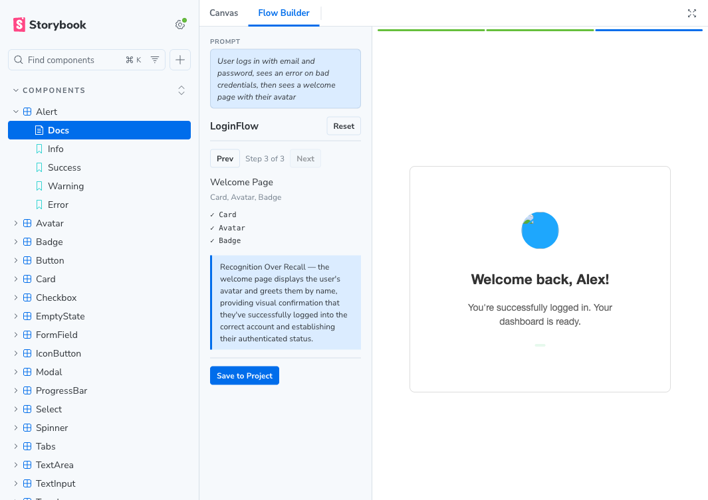

# Storybook Addon Flow Builder

AI-driven user flow creation for Storybook. Describe a user journey in plain English, and the addon reads your component library, composes your atomic components into realistic screen layouts, and renders live previews — all powered by Claude.

## Screenshots

### Describe your flow

Open the **Flow Builder** tab and type a user journey. The addon auto-discovers all components from your stories.



### Claude generates composed layouts

Claude analyses your library and decomposes the flow into steps, composing multiple atomic components into complete screens.



### Step through with live previews

Each step renders a **live preview** using your actual components — not mockups.

**Step 1 — Login Form** (Card + FormField + TextInput + Button)



**Step 2 — Error State** (Alert + Card + FormField + TextInput + Button)



**Step 3 — Welcome Page** (Card + Avatar + Badge)



## Installation

```sh
npm install --save-dev storybook-addon-flow-builder
```

Register in `.storybook/main.ts`:

```ts
const config = {
  addons: ['storybook-addon-flow-builder'],
};
export default config;
```

## Setup

Add your Anthropic API key in `.storybook/preview.ts`:

```ts
const preview = {
  parameters: {
    flowbuilder: {
      apiKey: import.meta.env.STORYBOOK_FLOWBUILDER_API_KEY,
    },
  },
};
export default preview;
```

Create a `.env` file (gitignored):

```
STORYBOOK_FLOWBUILDER_API_KEY=sk-ant-...
```

## Usage

1. Open Storybook and click the **Flow Builder** tab
2. Type a user flow description (e.g. "User logs in with email and password, sees an error on bad credentials, then sees a welcome page with their avatar")
3. Click **Generate Flow**
4. The addon discovers your components, calls Claude to compose each step, and renders live previews
5. Use **Prev/Next** to navigate steps
6. Click **Save to Project** to write story files to `src/stories/flows/`

Generated files include fixtures, MSW mock handlers, and flow stories with render functions that compose your components.

## Example prompts

- *User logs in with email and password, sees an error on bad credentials, then sees a welcome page with their avatar*
- *User browses a product card, adds to cart, enters shipping info, reviews order, and confirms payment*
- *User opens account settings, toggles email notifications on/off, changes their display name, and saves with a success confirmation*
- *New user sees a welcome modal, fills out a 3-step profile form with progress bar, and lands on an empty dashboard*
- *User searches for items, sees a loading spinner, gets results as cards, then filters by category*

## Development

```sh
pnpm install
pnpm start        # build in watch mode + Storybook dev server
pnpm build        # production build
pnpm storybook    # Storybook only
```
